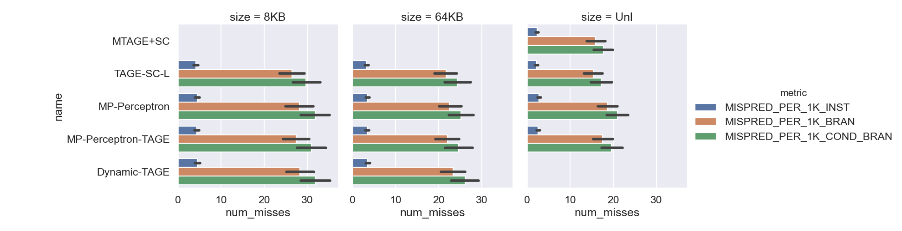
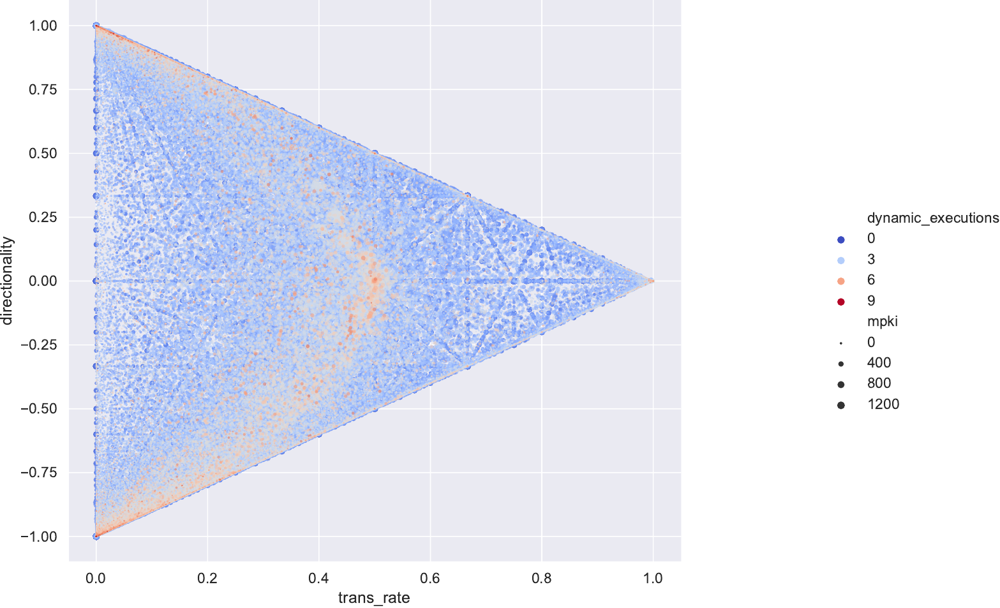
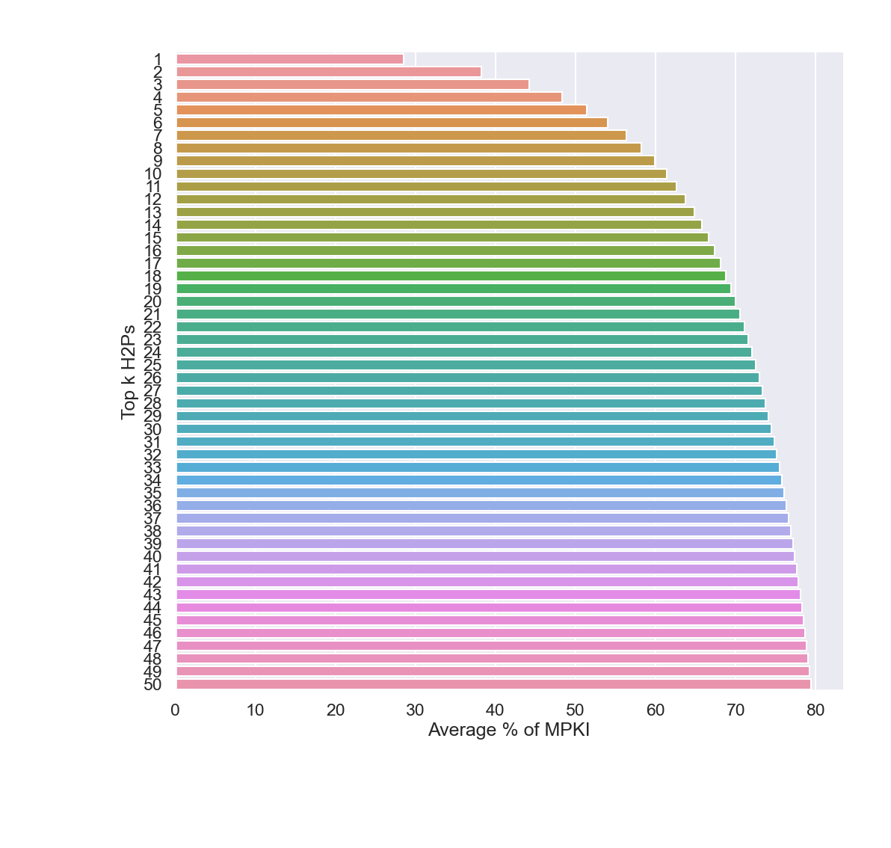

# CBP-16 Simulation and BPU Analysis

<p align="center">
    
</p>

This project makes use of the code provided from the 5th Championship Branch Prediction
competition held in 2016 (CBP-16). An augmented simulator is created here for studying
modern branch prediction units (BPUs). For the uninitiated, a BPU plays an important role
in increasing processor instructions per cycle (IPC) by speculatively executing instructions
before a branch instruction is resolved. The two main components of this work is via the
programs `simnlog` and `simpython`. These facilitate a deeper understanding of BPU
performance as well as opens the door to BPU simulation from a friendlier programming,
`Python`. Many machine learning toolkits, and thus many ML practitioners, are based
around the `Python` ecosystem. We provide scripts in this language for the analysis of BPU
performance as well as a `C++` simulator that instantiates and runs `Python`-written BPUs.
BPUs written in a high-level framework, e.g., `TensorFlow` or `scikit-learn`, can be
evaluated using the 200 training traces and 440 evaluation traces from CBP-16 (or other
traces in the BT9 format).

<p align="center">
    
</p>

### Installation

1. Clone this repository
2. As of 2023-03-09, it looks like the files hosted at [http://hpca23.cse.tamu.edu/cbp2016/](http://hpca23.cse.tamu.edu/cbp2016/)
are no longer available. If this is still the case, then the following step will not
work without manual intervention. Proceed by downloading all of the files from
[this Google Drive link](https://drive.google.com/drive/folders/1VAdmqdOEFLvnRKkQQidxvGJA_C6S2RWo?usp=sharing)
and placing them in the `data` folder.
3. Run the following (may prompt for `sudo` password for dependency installation (e.g.,
boost libraries) for setting up the original CBP-16 code and pulling in trace files:
    ```shell script
    cd scripts
    ./setup_cbp16.sh
    cd ..
    ```
3. Run the following to build the simulator with `Python` bindings and simulator that
logs prediction data to binary files.
    ```shell script
    cd cbp16sim
    make
    # Or if you only want to use program or the other
    #make simnlog
    #make simpython
    make clean
    cd ..
    ```
4. If you want to be able to run the `Python` scripts in the `scripts/` directory,
you'll need to install the required libraries.
    ```shell script
    pip install -r requirements.txt
    ```

### simpython
After following the installation instructions, you can run this program from the
`cbp16sim` directory. This program allows for the simulation and evaluation of
`Python`-based BPUs. By default, the program runs a dummy predictor that (excessively)
logs trace inputs and always predicts taken. To run the program:
```
$ cd cbp16sim
$ ./simpython
usage: ./simpython <trace> [<predictor_module>]
$ # Example usage (for default dummy predictor):
$ PYTHONPATH=src/simpython/ ./simpython ../cbp2016.eval/traces/LONG_SERVER-1.bt9.trace.gz
$ # Example usage (for custom my_predictor.py with PREDICTOR class in the same directory):
$ PYTHONPATH=. ./simpython ../cbp2016.eval/traces/LONG_SERVER-1.bt9.trace.gz my_predictor.py
```
Setting the `PYTHONPATH` environmental variable is important to informing the program where
your BPU module is located. This will be need to set by you unless your program is on a
`Python` standard library path (e.g., where packages from `pip` are installed).

To create your own module, you will need to inherit from the `BASEPREDICTOR` abstract
base class located in `cbp16sim/src/simpython/predictor.py`. For example usage,
see how the methods are implemented in the `dummy_predictor.py` file in the same
directory. You will need to name your class that inherits from `BASEPREDICTOR`
a special name: `PREDICTOR`. This is the name that the program looks for. Minimally,
your BPU must implement the `GetPrediction(...)` method, but you may also want to
implement `UpdatePredictor(...)` (which updates the predictor with the actual taken
direction) and/or `TrackOtherInst(...)` to track unconditional branches.

### sim'n'log
After following the installation instructions, you can run this program from the
`cbp16sim` directory. Note that by default the program is compiled to run the TAGE-SC-L
BPU (winner of CBP-16 in all categories). To change the BPU to one of the other submissions,
you'll need to replace the corresponding `predictor.cc` and `predictor.h` files in the
`cbp16sim/src/simnlog` directory. Primitive but functional. Here is some example usage:
```
$ cd cbp16sim
$ ./simnlog
usage: ./simnlog <trace>
$ # Example usage:
$ ./simnlog ../cbp2016.eval/traces/LONG_SERVER-1.bt9.trace.gz 
```
The program generates somewhat large binary files that log relevant branch data and
predictions. If you want to generate these logged files in bulk, you can run something
like the following (this only looks at short traces):
```shell script
find ../cbp2016.eval/evaluationTraces/ -iname 'SHORT_*.gz' | xargs -n 1 ./simnlog
```
If you want to get fancy and have the CPU compute power to handle it, you can run the
program in parallel via `xargs` by `xargs -n 1 -P 8` - this tells `xargs` to run 8
instances of the program in parallel for the next 8 inputs given by `find`.

Afterwards, if you would like to generate plots of the data and perform other analyses,
you can run some of the scripts from the `scripts/` directory. Before running `simnlog`,
you can analyze the results files from previously generated runs using the original CBP-16
simulator or the extracted results from the CBP website (both stored in
`cbp2016.eval/results`). This can be simply run using the `analyze_cbp16_results.py`
script. To look at the generated binary files, you will first need to aggregate statistics
using the `process_traces.py` script. The parameters of the file will default to look at
generated `.dat` files and store results in a `processed_traces` directory. You will need
to take a look in the file to make directory modifications at the moment. After, you can run
the `analyze_processed_trace.py` script to generate plots (like the one above and below) and
some statistics.

<p align="center">
    
</p>

If you want to play with the generated `Python` files yourself, here is the boilerplate
code you should follow.
```python
# The field names of the generated binary format. Each element is a struct of 24 bytes
# containing the following data.
names = 'branchTaken', 'predDir', 'conditional', 'opType', 'branchTarget', 'PC'
# These are the numerical formats for each piece of data (first three are Booleans)
formats = 'u1', 'u1', 'u1', 'u4', 'u8', 'u8'
# The memory offsets for each element (note that there is 1 byte of padding at offset 3)
offsets = 0, 1, 2, 4, 8, 16
# Creation of the NumPy dtype
import numpy as np
bpu_dtype = np.dtype(dict(names=names, formats=formats, offsets=offsets))
```
After, you can load in the file and even treat it as a pandas DataFrame, the keys being
the 6 field names in the above code.
```python
with open('filename.dat', 'rb') as f:
    data = f.read()
    a = np.frombuffer(data, bpu_dtype)

import pandas as pd
df = pd.DataFrame(a)
```
